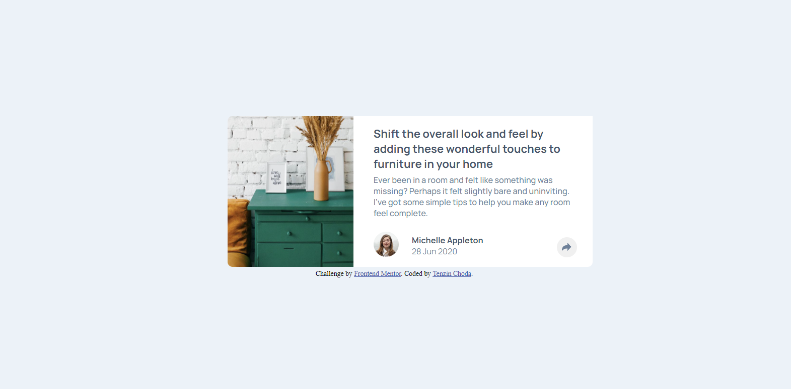
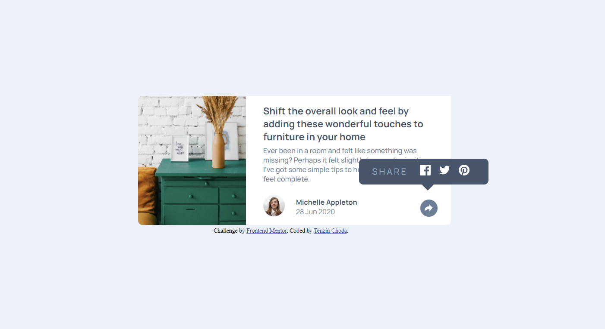
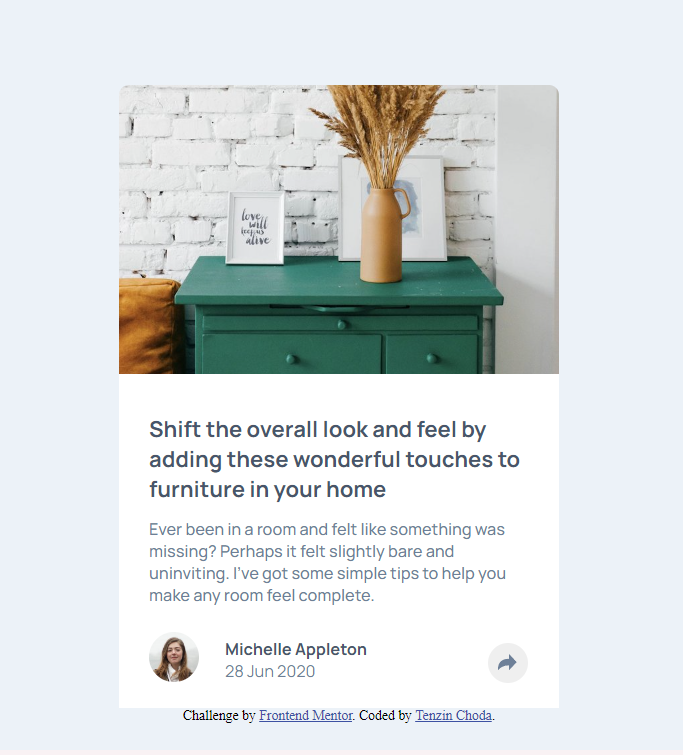
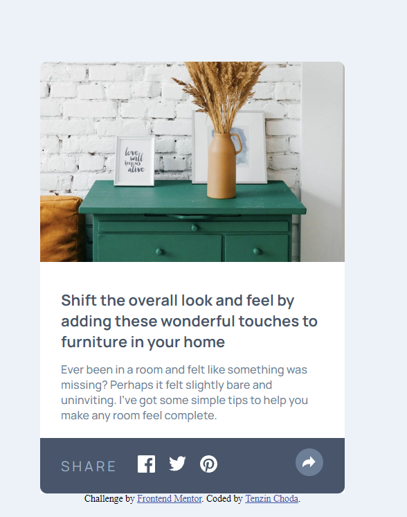

# Frontend Mentor - Article preview component solution

This is a solution to the [Article preview component challenge on Frontend Mentor](https://www.frontendmentor.io/challenges/article-preview-component-dYBN_pYFT). Frontend Mentor challenges help you improve your coding skills by building realistic projects. 

## Table of contents

- [Overview](#overview)
  - [The challenge](#the-challenge)
  - [Screenshot](#screenshot)
  - [Links](#links)
- [My process](#my-process)
  - [Built with](#built-with)
  - [What I learned](#what-i-learned)
- [Author](#author)
- [Acknowledgments](#acknowledgments)


## Overview
I have finally completed the article preview component challenge as described in the challenge section below. It took a while as I had reached college while I was in the midst of completing this challenge and didn't get time to open it up. 

### The challenge

Users should be able to:

- View the optimal layout for the component depending on their device's screen size
- See the social media share links when they click the share icon

### Screenshot
#### Desktop design


####  Desktop Active State


#### Mobile Design


#### Mobile Active State


### Links

- Solution URL: [View my solution on frontend mentor]()
- Live Site URL: [View the Live site](https://article-preview-component-five-flame.vercel.app/)

## My process
Like in all other projects I start from the broader view and go down to the smaller components, steadily perfecting every part.
### Built with

- Semantic HTML5 markup
- CSS custom properties
- Flexbox
- Mobile-first workflow

### What I learned
- I learned some efficient styling methods from this challenge while I was working on the button and the active states.
- I learned to change the color of a SVG.
```
.btn-active .share-icon path{
  fill: #fff;
}
```
This code changes the color of the share icon which is a SVG for this you need to use the SVG in line in HTML instead of using it as a image.
- Another interesting thing I learned was to set up the share links in a bubble I had used the CSS `::after` psuedo-element. 


## Author

- Frontend Mentor - [@tenze21](https://www.frontendmentor.io/profile/tenze21)
- Twitter - [@TenzinChoe17842](https://www.twitter.com/TenzinChoe17842)

## Acknowledgments
I am pretty much greatful to frontend mentor for this exciting challenge.
